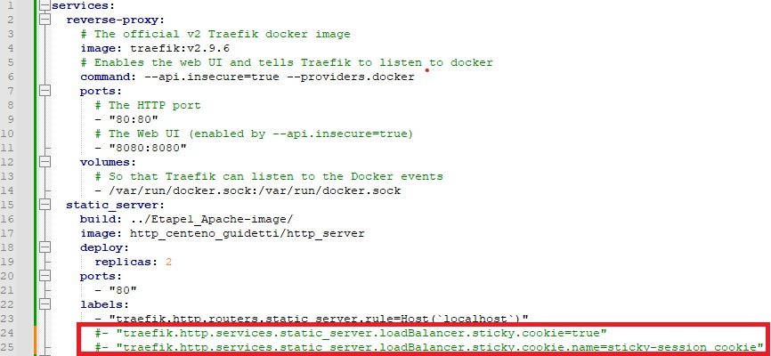
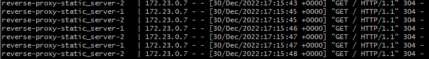
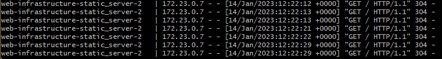
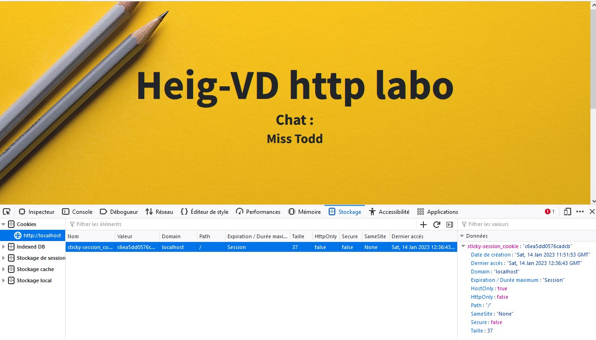

# Étape 5 : Répartition de charge: round-robin et sessions permanentes 
Laetitia Guidetti et Cédric Centeno

## Description

La gestion des deux serveurs (statique et dynamique) est faite par Trafik, le 
moyen de répartition des charges est par défaut Round Robin. 

Le but est de changer le mode de distribution de charge du serveur statique en 
mode de session permanente. Cela est notamment utile quand les actions de l'utilisateur doivent être gardées connues
(par exemple : l'état d'un panier sur un site de shopping).

Une session permanente permet d'établir un lien entre un client et un serveur 
(dans notre cas, un cookie). Ce lien permet de diriger les requêtes du client 
vers le même serveur.

Cette partie se base sur l'étape 3, une modification est apportée du docker-compose pour gérer les sessions
presistantes sur le serveur statique.

### Contenu du dossier, accès aux pages Web

Voir [**readmeEtape3**](readmeEtape3.md)

## Configuration

La configuration est identique à [**l'étape 3**](readmeEtape3.md), à l'exception 
de l'ajout des sessions permanente sur le serveur statique.
### Modification docker-compose

Ajout de labels permettant d'activer les sessions permanentes à l'aide de cookies.
- ```"traefik.http.services.static_server.loadBalancer.sticky.cookie=true"```
- ```"traefik.http.services.static_server.loadBalancer.sticky.cookie.name=sticky-session_cookie"```


## Demonstration du fonctionnement

### Sans l'ajout du cookie
- Mettre en commentaire les lignes permettant la session permanente dans le 
  docker-compose.yml.

  
- Exécuter le script ```docker-compose-run.sh```, garder le terminal ouvert
- Dans un navigateur, accéder à localhost, rafraîchir la page plusieurs fois afin de 
  constater sur le terminal que la charge est distribuée sur des 
  instances différentes.

  

### Avec cookie
- Si les lignes de docker-compose.yml concernant le cookie sont commentées, les 
  décommenter.
- Exécuter le script ```docker-compose-run.sh```, garder le terminal ouvert
- Dans un navigateur, accéder à localhost, rafraîchir la page plusieurs fois afin de
  constater sur le terminal que la charge est distribuée sur la 
  même instance.

  
- On peut observer dans le navigateur que le cookie est bien présent.

  

Si l'on souhaite avoir une chance de changer d'instance de serveur, il y a plusieurs options :
- Modifier le cookie
- Supprimer le cookie
- Utiliser une session de navigateur privée