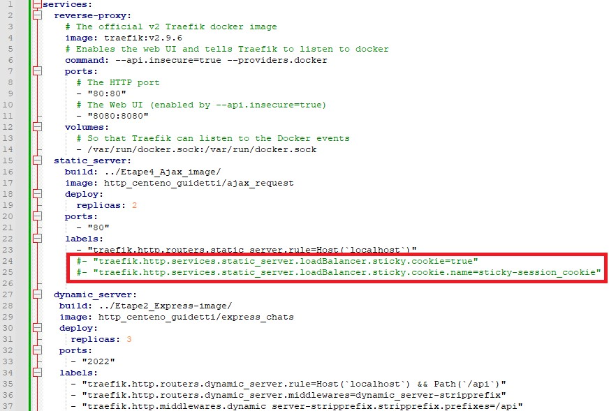
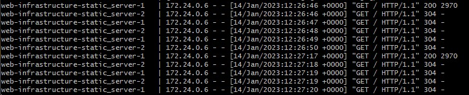

# Étape 5 : Répartition de charge: round-robin et sessions permanentes 
Laetitia Guidetti et Cédric Centeno

## Description

Cette partie est une modification apportée au serveur http statique de l'étape 3.

La gestion des deux serveurs (statique et dynamique) est faite par Trafik, le 
moyen de répartition des charges est par défaut Round Robin. 

Il s'agit dans cette 
étape de changer le mode de distribution de charge du serveur statique en 
mode de session permanente.

Une session permanente permet d'établir un lien entre un client et un serveur 
(dans notre cas, un cookie). Ce lien permet de diriger les requêtes du client 
vers le même serveur.

### Contenu du dossier, accès aux pages Web

Voir [**readmeEtape3**](readmeEtape3.md)

## Configuration

La configuration est identique à [**l'étape 3**](readmeEtape3.md), à l'exeption 
de l'ajout des sessions permanente sur le serveur statique.
### Modification dockerCompose
#### static_server
Ajout d'un label permettant d'activer les sessions permanentes à l'aide de cookies.

## Demonstration du fonctionnement

### Sans l'ajout du cookie
- Mettre en commentaire les lignes permettant la session permanente dans le 
  docker-compose.yml.

  
- Exécuter le script ```docker-compose-run.sh```, garder le terminal ouvert.
- Dans un navigateur, accéder à localhost, rafraichir plusieurs fois afin de 
  constater sur le terminal ayant exécuté que la charge est distribuées sur des 
  instances différentes.

  

### Avec cookie
- Si les lignes de docker-compose.yml concernant le cookie sont commentée, les 
  décommenter.
- Exécuter le script ```docker-compose-run.sh```, garder le terminal ouvert.
- Dans un navigateur, accéder à localhost, rafraichir plusieurs fois afin de
  constater sur le terminal ayant exécuté que la charge est distribuées sur la 
  même instance.

  
- On peut observer dans le navigateur que le cookie est bien présent.

  

Si l'on souhaite avoir une chance de changer d'instance de serveur, il y a plusieur options :
- modifier le cookie
- supprimer le cookie
- utilisé une session de navigateur privée