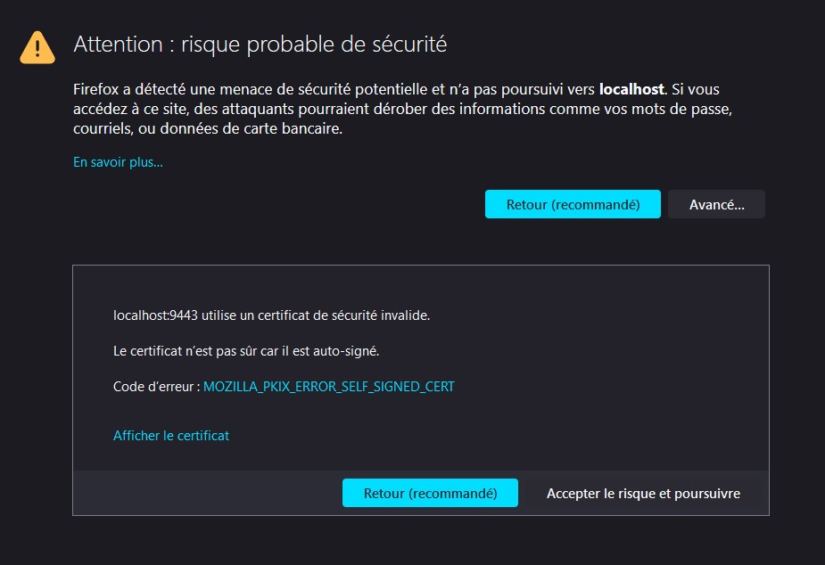

# Étape 6 : Gestion des containers de l'interface web
Laetitia Guidetti et Cédric Centeno

## Description

Cette partie contient l'ajout d'une interface web permettant de gérer notre 
interface web.

Nous utilisons une interface web existante : 
Portainer (community edition).

A travers cette interface, il est possible de lister les containers, images, 
stacks (instances créer par dockerCompose), de les démarrer/arrêter et de les 
supprimer.


## Commande pour deployer le serveur portainer
### Avec script
Pour accéder au script, ouvrir un terminal et accéder au chemin 
```docker-images/Etape6_UI-management```. Puis exécuter le script avec la 
commander ```./run-portainer.sh```.
### Sans script
Ouvrir un terminal pour entrer les deux commandes suivantes :
- ```docker volume create portainer_data``` : Créer un volume que le serveur 
  Portainer utilisera pour stocker sa base de donnée.
- ```docker run -d -p 8000:8000 -p 9443:9443 --name portainer --restart=always -v/var/run/docker.sock:/var/run/docker.sock -v portainer_data:/data portainer/portainer-ce:latest``` : Télécharger, installer et lancer le container du 
  serveur Portainer.

### Détails sur les commandes du script/commandes entrées :
  - ```-d``` : detach en anglais, afin de ne pas avoir l'ouput sur le terminal 
    actuel.
  - ```-p 8000:8000 -p 9443:9443``` : les ports utilisés par l'application
  - ```--name portainer``` : donne un nom au container
  - ```restart=always``` : redémarre le serveur Portainer s'il crash
  - ```-v /var/run/docker.sock:/var/run/docker.sock``` : monte dans le container la 
    socket Docker qui tourne sur l'appareil utilisé (windows WSL ou linux). Cette socket permet la 
    communication avec l'api de Docker.
  - ```-v portainer_data:/data portainer/portainer-ce:latest``` : monte dans le 
    container le volume créer précédemment qui contient les fichiers de configuration.

## Se connecter à l'interface web
Pour ce connecter à l'interface web, ouvrir un navigateur web et accéder à 
```https://localhost:9443```. Il est possible qu'une fenêtre indiquant un risque 
de sécurité s'affiche, exemple ici sur firefox :



Pour la démonstration, on peut cependant l'ignorer en cliquant sur ```Avancé``` puis 
```Accepter le risque et poursuivre```.

Pour la première exécution, la page de login de portainer devrait ensuite s'afficher.
Il faut créer un utilisateur puis appuyer sur ```Create user```. Enfin, appuyer sur 
Get started pour accéder aux containers Dockers. 


Autrement, simplement ce login sur portainer.

Ensuite, pour accéder aux serveurs gérés par Traefik de [l'etape 5](readmeEtape5.md), aller dans Stack, puis reverse-proxy.

Vous pouvez maintenant gérer les instances des serveurs statiques et dynamiques à 
travers une interface web.


